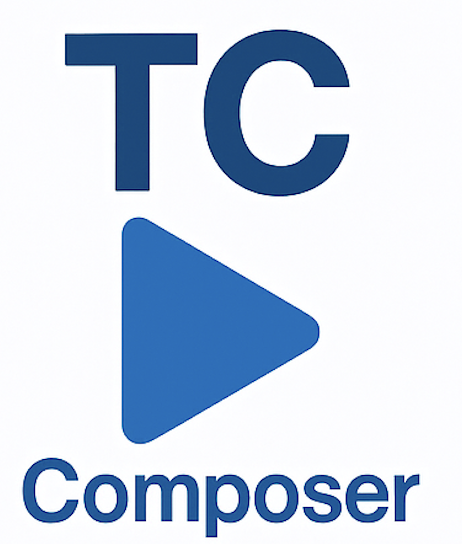

# TestComposer

**TestComposer** is the software control and automation engine of the TC-Platform.  
Its goal is to provide modular, platform-independent, and easily extensible test sequences, measurement processes, and reporting for labs, developers, and manufacturers.

---

## Key Features

- **Modular sequence editor** (visual and text-based)
- **PyVISA compatibility** – control any VISA instrument
- **JSON-based sequence description** (OpenTAP compatible)
- **InfluxDB + Grafana reporting**
- **Client-server architecture** (standalone or with Raspberry Pi plugin module)
- **3rd party integrations** (Home Assistant, IoT, BMS, etc.)
- **Open source, community-driven development**

---

## Documentation

- [TC-Platform main repo](https://github.com/Horikari/TC-Platform) – ecosystem, architecture, branding, integrations
- [TestCombiner](https://github.com/Horikari/TestCombiner) – modular instrument hardware
- [TestCube](https://github.com/Horikari/TestCube) – expandable fixture and plugin system

---

## Contributing

Ideas, bug reports, pull requests, and forks are **welcome from everyone!**

---

## License

This project is licensed under the MIT License.  
See: [LICENSE](LICENSE)

---

© 2025 Horikari
